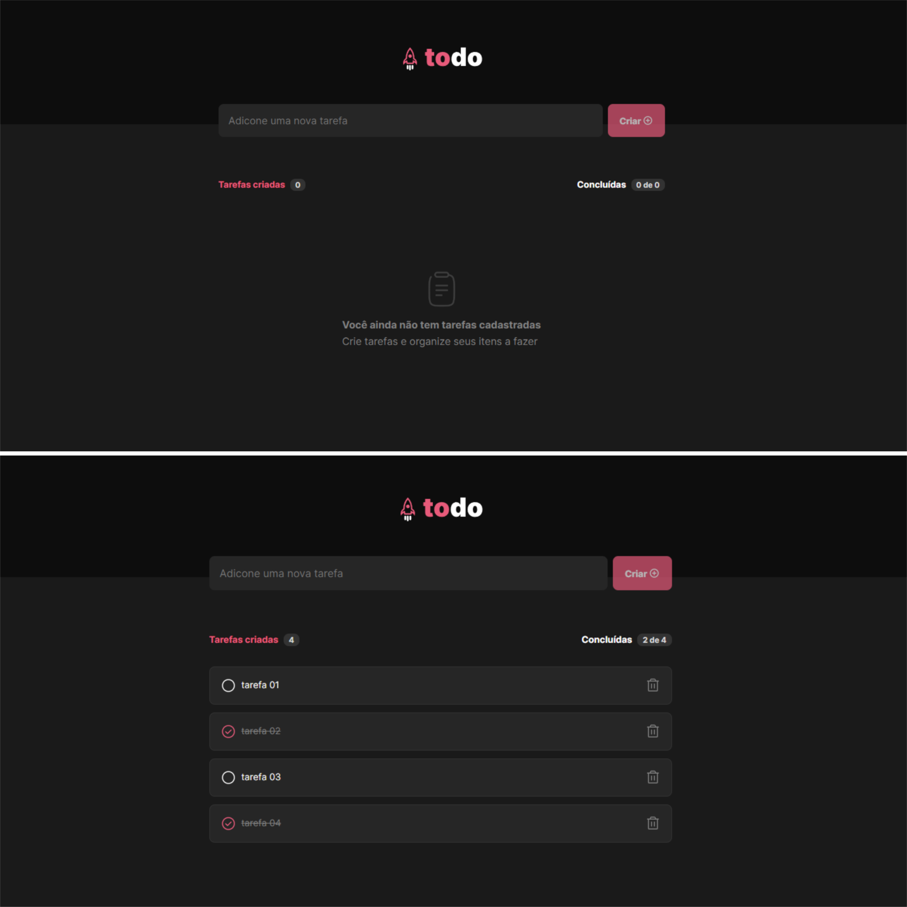

<h1 align="center"> TODO LIST </h1>

<p align="center">
Desafio proposto pela Rocketseat
</p>

<p align="center">
  <a href="#-tecnologias">Tecnologias</a>&nbsp;&nbsp;&nbsp;|&nbsp;&nbsp;&nbsp;
  <a href="#-projeto">Projeto</a>&nbsp;&nbsp;&nbsp;|&nbsp;&nbsp;&nbsp;
  <a href="#-produção">Produção</a>&nbsp;&nbsp;&nbsp;|&nbsp;&nbsp;&nbsp;
  <a href="#-próximos-passos">Próximos passos</a>&nbsp;&nbsp;&nbsp;|&nbsp;&nbsp;&nbsp;
  <a href="#memo-licença">Licença</a>
</p>

<p align="center"> 
  
  <a href="https://rocketseat.com.br">
    
  </a>
  
  <a href="https://github.com/elenmagalhaes/todo-web/stargazers">
    
  </a>
</p>

<br>

<p align="center">
  
</p>

## 🚀 Tecnologias

Esse projeto foi desenvolvido com as seguintes tecnologias:

- [React](https://pt-br.reactjs.org)
- [Sass](https://sass-lang.com)
- [ViteJs](https://vitejs.dev)
- [Phosphor Icons](https://github.com/phosphor-icons/homepage)

## 💻 Projeto

A aplicação permite ao usuário o cadastro, remoção e conclusão de tarefas. Após o cadastro ou conclusão, o sistema controla o progresso das tarefas.

## ✏ Próximos passos

- [ ] Revalidar nomenclatura utilizada para o nome das classes da aplicação.

## 🔖 Produção

Para visualizar o layout da aplicação e interagir com o sistema, [acesse aqui](https://todo-list-app-hazel.vercel.app).

```
yarn / npm
```

```
yarn run dev / npm run dev
```

## :memo: Licença

Esse projeto está sob a licença MIT.

---

Projeto em desenvolvimento por Elen Magalhães
